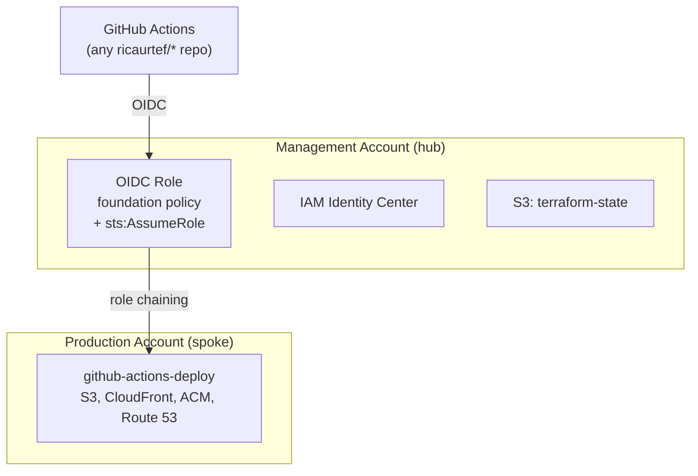
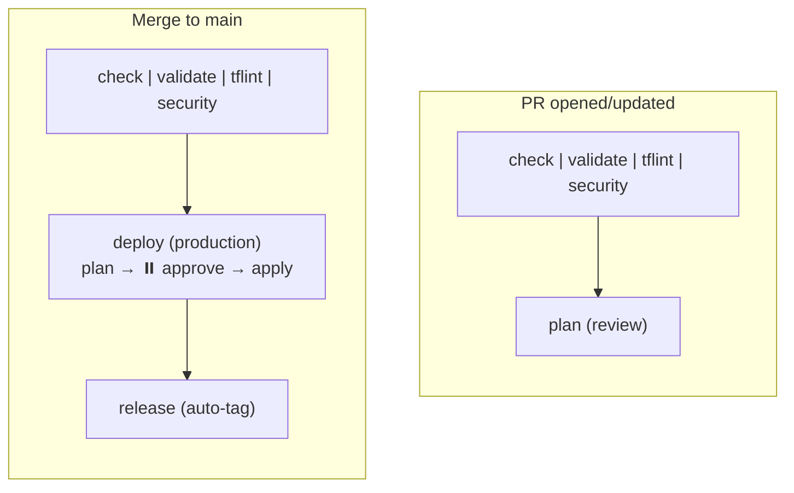

<!-- BEGIN_TF_DOCS -->
# AWS Account Foundation


---

Provisions the foundational layer of a personal AWS account: Organizations, IAM Identity Center,
OIDC federation for GitHub Actions, and the Terraform state bucket. Everything that needs to exist
before workload-specific infrastructure can be deployed.

## Architecture



## Repository structure

```
aws-account-foundation/
├── setup/
│   └── bootstrap/           # State bucket (manual, one-time)
├── env/
│   └── production.tfvars    # Environment-specific values
├── .config/                 # Integration tooling configs
├── .github/workflows/       # CI/CD pipeline
├── organization.tf          # AWS Organizations + member accounts
├── sso.tf                   # Identity Center, permission sets, users, assignments
├── oidc.tf                  # OIDC federation (external module)
├── iam.tf                   # IAM roles + role policies (hub + spoke)
├── data.tf                  # IAM policy documents + SSO data sources
├── variables.tf             # Root variables (no defaults — driven by tfvars)
├── outputs.tf               # Root outputs
├── providers.tf             # AWS providers (default + production alias)
├── backend.tf               # S3 backend (partial — populated at init time)
└── versions.tf              # Terraform + provider version constraints
```

## Hub-and-spoke IAM

All pipelines authenticate through a single OIDC role in the management account (hub).
When a workload needs to deploy to the production account (spoke), it chains into the
`github-actions-deploy` role via `sts:AssumeRole`.

| Role | Account | Purpose |
|------|---------|---------|
| `OIDC-Assumable-Role-*` | Management | Hub — OIDC entry point, foundation policy |
| `github-actions-deploy` | Production | Spoke — S3, CloudFront, ACM, Route 53 |

The production role's policy is managed here. When a new project needs a new AWS service,
expand the policy in this foundation — not in the workload project. One PR, all projects
benefit.

## Prerequisites

- An AWS account with an Organization already created.
- Local AWS credentials with admin access (for the one-time bootstrap).
- GitHub repository secrets/variables (configured during bootstrap):
  - `AWS_ROLE_ARN` (repository variable) — the OIDC role ARN.
  - `ANTHROPIC_API_KEY` (repository secret) — for Claude code review.

## Bootstrap

The pipeline depends on OIDC federation, which is deployed by this project. To break the
chicken-and-egg cycle, the first deployment is manual. After that, the pipeline is
self-sustaining.

**Step 1 — Create the state bucket:**

```bash
cd setup/bootstrap
terraform init
terraform apply
```

**Step 2 — Deploy the foundation (creates the OIDC role):**

```bash
cd ../..
terraform init \
  -backend-config="bucket=ricaurtef-terraform-state" \
  -backend-config="key=personal/us-east-1/account-foundation/terraform.tfstate" \
  -backend-config="region=us-east-1" \
  -backend-config="encrypt=true" \
  -backend-config="use_lockfile=true"

terraform apply -var-file=env/production.tfvars
```

**Step 3 — Enable the pipeline:**

Copy the `role_arn` output and set it as a GitHub repository variable:

```bash
gh variable set AWS_ROLE_ARN --body "$(terraform output -raw role_arn)" --repo ricaurtef/aws-account-foundation
```

From this point forward, all changes go through the CI/CD pipeline.

## CI/CD pipeline



- **PR:** quality gates + plan for review.
- **Merge:** quality gates + deploy with `production` environment approval gate + automatic release.
- Backend config injected at `terraform init` via `-backend-config` flags.
- Environment values from `env/production.tfvars` via `-var-file`.

## Required tools

| Tool | Purpose |
|------|---------|
| [Terraform](https://developer.hashicorp.com/terraform/install) | Infrastructure as Code |
| [terraform-docs](https://terraform-docs.io/user-guide/installation/) | README generation |
| [TFLint](https://github.com/terraform-linters/tflint#installation) | Terraform linter |
| [Checkov](https://www.checkov.io/2.Basics/Installing%20Checkov.html) | Security / policy scanning |
| [Trivy](https://aquasecurity.github.io/trivy/latest/getting-started/installation/) | Vulnerability / secret scanning |
| [pre-commit](https://pre-commit.com/#installation) | Git hook manager |

> Once all tools are installed, run `make setup` to initialise pre-commit hooks, TFLint plugins,
> and the Terraform working directory.

## Releasing

Releases are automated after a successful deploy. Each merge to `main` that passes the
`production` approval gate gets a patch version bump and a GitHub Release with auto-generated
notes.

The version is derived from the latest `v*.*.*` tag. The first release starts at `v1.0.0`.

## Requirements

| Name | Version |
|------|---------|
| <a name="requirement_terraform"></a> [terraform](#requirement\_terraform) | ~> 1.14 |
| <a name="requirement_aws"></a> [aws](#requirement\_aws) | ~> 6.27 |
## Providers

| Name | Version |
|------|---------|
| <a name="provider_aws"></a> [aws](#provider\_aws) | 6.39.0 |
| <a name="provider_aws.production"></a> [aws.production](#provider\_aws.production) | 6.39.0 |
## Modules

| Name | Source | Version |
|------|--------|---------|
| <a name="module_oidc"></a> [oidc](#module\_oidc) | git::https://github.com/ricaurtef/terraform-aws-oidc-federation.git | 3d6b8115475699d23d8601c8fc3bebd73f0b4b9c |
## Inputs

| Name | Description | Type | Default | Required |
|------|-------------|------|---------|:--------:|
| <a name="input_admin_email"></a> [admin\_email](#input\_admin\_email) | Email address for the admin Identity Center user. | `string` | n/a | yes |
| <a name="input_environment"></a> [environment](#input\_environment) | Deployment environment (e.g., production, staging). | `string` | n/a | yes |
| <a name="input_github_owner"></a> [github\_owner](#input\_github\_owner) | GitHub account owner for OIDC federation. | `string` | n/a | yes |
| <a name="input_production_account_email"></a> [production\_account\_email](#input\_production\_account\_email) | Email address for the production member account. | `string` | n/a | yes |
| <a name="input_production_account_id"></a> [production\_account\_id](#input\_production\_account\_id) | AWS account ID of the production workload account. | `string` | n/a | yes |
| <a name="input_region"></a> [region](#input\_region) | AWS region. | `string` | n/a | yes |
## Outputs

| Name | Description |
|------|-------------|
| <a name="output_organization_id"></a> [organization\_id](#output\_organization\_id) | ID of the AWS Organization. |
| <a name="output_production_account_id"></a> [production\_account\_id](#output\_production\_account\_id) | Account ID of the production workload account. |
| <a name="output_production_deploy_role_arn"></a> [production\_deploy\_role\_arn](#output\_production\_deploy\_role\_arn) | ARN of the shared deployment role in the production account. |
| <a name="output_role_arn"></a> [role\_arn](#output\_role\_arn) | ARN of the OIDC role (management account). |
<!-- END_TF_DOCS -->